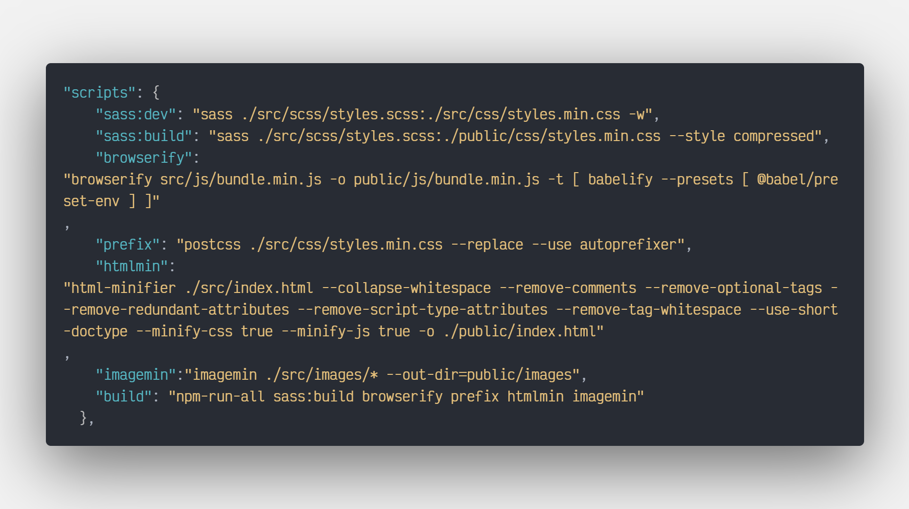

<h1 align="center">Cli-Workflow</h1>

# Workflow Sass, browserify/babelify, PostCSS/Prefix, htmlmin & imagemin

Workflow Sass, browserify/babelify, PostCSS/Prefix, htmlmin & imagemin for static page projects.

Use dart-sass 1.32.12.

Transpile the HTML, CSS and JavaScript so that it is possible to work in a development folder and another folder with all the minified and built files for uploading to the server

Optimizes JPG, JPEG, GIF, PNG and SVG images


***

<p align="center">
  
</p>

## How To Use

### Use **VSCode's Live Serve** and script **'sass:dev'** in mode deveploment in the src folder.

### Use script **'build'** in mode production.


```bash
# Clone this repository
$ git clone https://github.com/cqrlosArch/cli-workflow

# Install dependencies
$ 'yarn install' or 'npm install'

# Run browserify mode development
$ 'yarn browserify:dev' or 'npm run browserify:dev'

# Run sass mode development
$ 'yarn sass:dev' or 'npm run sass:dev'

# Run postcss mode development
$ 'yarn prefix:dev' or 'npm run prefix:dev'

# Run htmlmin mode development
$ 'yarn htmlmin' or 'npm run htmlmin'

# Run imagemin mode development
$ 'yarn imagemin' or 'npm run imagemin'

# Run script mode production
$ 'yarn build' or 'npm run build'
```

## Details

### Built With

- [Sass](https://sass-lang.com/)
- [imagemin-cli](https://www.npmjs.com/package/imagemin-cli)
- [browserify](https://browserify.org/)
- [babelify](https://github.com/babel/babelify)
- [babel](https://babeljs.io/)
- [postcss](https://postcss.org/)
- [autoprefixer](https://github.com/postcss/autoprefixer)
- [html-minifier](https://www.npmjs.com/package/html-minifier)

## License

[MIT License](./LICENSE)

## Contact

- Discord [CqrlosArch#0296](https://discord.com/)
- Twitch [@cqrlosarch](https://www.twitch.tv/cqrlosarch/about)
- GitHub [@cqrlosArch](https://github.com/cqrlosArch)
- Twitter [@cqrlosArch](https://twitter.com/cqrlosArch)
- Youtube [Cqrlos Arch](https://www.youtube.com/channel/UCV8eaXiCFXUN5Rkpc42G3ZQ)
